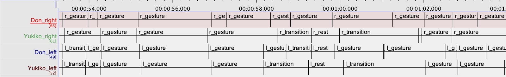

# Annotating Start of Gestures:

Sequences of hand/arm motions are often in sync with the speech of the speaker, conveying synchronous communicative meaning. Gaining a better understanding of the types of arm/hand motions accompanying speech is crucial to gain more insight about human communication. In order to adress this aspect, we developed an annotation scheme to collect annotations on the timing and type of various motions from videos of talk show monologues. In this report, we will discuss our findings and methodologies in developing an annotation scheme for arm/hand motions and the results of MTurk trial experiments.

## Defining the Annotation Scheme:

Our purpose behind developing a set of definitions for different types of hand/arm motions was to have an unambiguous criteria, which annotators could use to annotate specific segments of talk show monologue videos. We hoped to use these annotations in order to understand what kind of speech (acoustics and language) would trigger hand/arm motions that would also convey a communicative meaning. Hence, the annotations would highlight sections of videos, in which the speaker’s hand/arm motions were also conveying a communicative meaning.
	The annotator had to simultaneously listen to the speech to find out which motions seemed contain a communicative meaning, in addition to marking the exact frame in which the motion began (the ending can be found by looking at the start time of the next motion). Unlike other simple annotation tasks, annotating for start times of motions and their types proved to be labor intensive, with a minute long video taking an hour to annotate (for both left and right arms). Therefore, it was extremely crucial for the motion of interest to be defined concisely and the annotation scheme to be oriented specifically towards finding motions that is in sync with speech to convey a communicative meaning. 

Initially, we used the following definitions for our annotation scheme (Kita, et al 2012) :

- **Preparation**: a non-stroke phase that departs from the resting position
- **Stroke** : a phase in which more force is exerted than neighbouring phases. Acceleration is a good indicator of the exerted force (but sometimes a downward retraction has bigger acceleration than a stroke because of the gravity). A stroke sometimes consists of multiple motions.
- **Hold**: a phase in which the hand is held still. A stroke is frequently followed by a hold.
- **Retraction**: a non-stroke phase the arrives at the resting position.

Although the above annotation scheme was simple, which allowed for efficient annotations, after trial runs, it was found that the annotations were useful in finding phases of motions of different velocity. However, the annotations were ineffective at determining which motions portrayed communicative meaning. 

### Our Annotation Scheme

We propose a new scheme that focuses on differentiating phases with and without communicative meaning. A phase is an interval in the video with different kinds of arm and hand motions or lack thereof. There are 3 types of phases designed to capture sequences of arm motions/non-motions which does or does not portray a communicative meaning. 

Fig. 1: Phase Definitions

|         -         | Motion - Present| Motion - Absent| 
|         ---           | ---   | ---   | 
| **Meaning - Present** |   Gesture  |  Gesture   | 
| **Meaning - Absent**  |   Transition  | Rest    | 

- Motion - Present: There exists a distinguishable difference in the velocity of the whole body and the hand/arm.
- Motion - Absent: No distinguishable difference in the velocity of the whole body and the hand/arm.
- Meaning - Present: A communicative meaning is conveyed 
- Meaning - Absent: No communicative meaning is not conveyed 

#### Gesture:

Our annotation scheme is divided into 3 phases: gesture, rest and transition. A phase in which the arm/hands convey a communicative meaning (with or without motion) is called a Gesture. A Gesture could be a single motion or a sequence of motions. An annotation should be made per communicative meaning. For instance, if the speaker conveys a single communicative meaning via one motion, it should be labeled as one phase and should be annotated separately. Likewise, if a single communicative meaning is conveyed via a sequence of motions, the entire sequence should be considered as a single phase. If there is a sequence of motion, where each motion refers to a distinguishably different communicative meaning, the sequence should be broken apart and each motion should be annotated separately as individual Gestures.  A phase that has no motion but that conveys a communicative meaning is still considered as a Gesture. Because speakers often use a strategic pause accompanying speech to emphasize or convey a communicative meaning, that phase is also considered as Gesture.

#### Transition:

Transition is a phase with motion of hand/arm to prepare for the next phase. It does not have a communicative meaning of its own. It is often used to move from one gesture to another, or from gesture to hold, etc. They are often filler motions that have no communicative meaning. 

#### Rest: 

Rest is a phase with no motion and conveys no communicative meaning. Often, many phases involve the host placing his/her hands at a natural resting place. These phases are insignificant and convey no communicative meaning. 

#### Summary:

- Gesture :  A phase with motion or a series of motions of the hand/arm that have a communicative meaning (may include a strategic pause which also has a communicative meaning) 
- Transition : A phase with motion of hand/arm to prepare for the next phase. It does not have a communicative meaning of its own.
- Rest : A phase with no motion and does not convey any communicative meaning. 

### Trials:

Fig. 2: CMU Researchers Annotations

Fig 3. MTurk Annotations

|WorkerID|Annotations|Start Times|
| ---  | --- | --- | 
| A29ZTF7JUO8F39  | gesture,transition,rest,gesture,rest,transition,gesture,switch,gesture,rest,gesture | 0,8.1856,10.9196,14.8473,18.0775,19.5221,20.7573,,0,8.9198,17.0401 | 
| A2AOZG41TRA7UZ | transition,switch | 23.667,23.6669 |
| AO4KFX0CY0SQD | transition,transition,transition,transition,transition,rest,rest,rest,rest,transition,rest,rest,rest,rest,rest,rest,transition,transition,rest,rest,gesture,rest,gesture,transition,transition,transition,transition,transition,transition,gesture,gesture,transition| 0.4163,1.1094,1.7998,2.3045,3.0645,3.7570,4.7751,5.3990,6.0774,6.6982,9.6744,11.8489,12.3775,13.5631,14.2874,14.9183,15.3550,15.7521,16.1493,16.1493,16.6652,17.1446,18.4316,19.7045,20.4579,21.2017,21.6383,22.1552,22.5998,22.9894,23.3577,23.6669 | 
| A28RGK00V59HVE | switch,switch,switch,switch,switch | 3.3104,22.7069,4.6682,8.7937,17.2074 |
| AJ1TRQ366ASX9 | gesture,gesture,gesture,gesture,rest,transition,gesture,gesture,gesture | 0.4658,1.9651,3.6442,6.4854,10.0683,15.3708,16.8265,19.9339,21.6435 |

After many iterations, we were able to get satisfactory annotations for trained CMU researchers. However, there was still some discrepancies between what should be considered a Gesture and Transition. 

We conducted an MTurk trial experiment for 11 hits on two 20 second videos of talk show monologues. We discovered that the annotations returned by MTurkers were of poor quality. After qualitative examination of the returned annotations, we found that very few MTurkers were actually completing the task. Many submitted incomplete annotations (with little to no annotations). Furthermore, among the very few that completed the assignment, MTurkers were struggling to understand the definitions. The annotations that were submitted did not provide the timing and the types of gestures we were looking for. Specifically, MTurkers were having difficulty understanding the difference between transition and gesture. Furthermore, the timings of these individual gestures were not being marked meticulously as we desired.

## Conclusion:

We were able to develop an annotation scheme for the start time of gestures that worked for highly trained annotators. However, we found that the same task proved to be a challenge as an MTurk assignment. The task’s initial learning curve and its labor intensity made it difficult for an ordinary MTurker to complete. Because the reliability of these annotations are crucial in terms of modelling, we have concluded that it is inefficient to proceed given the inconsistency in the MTurk trial results. 

